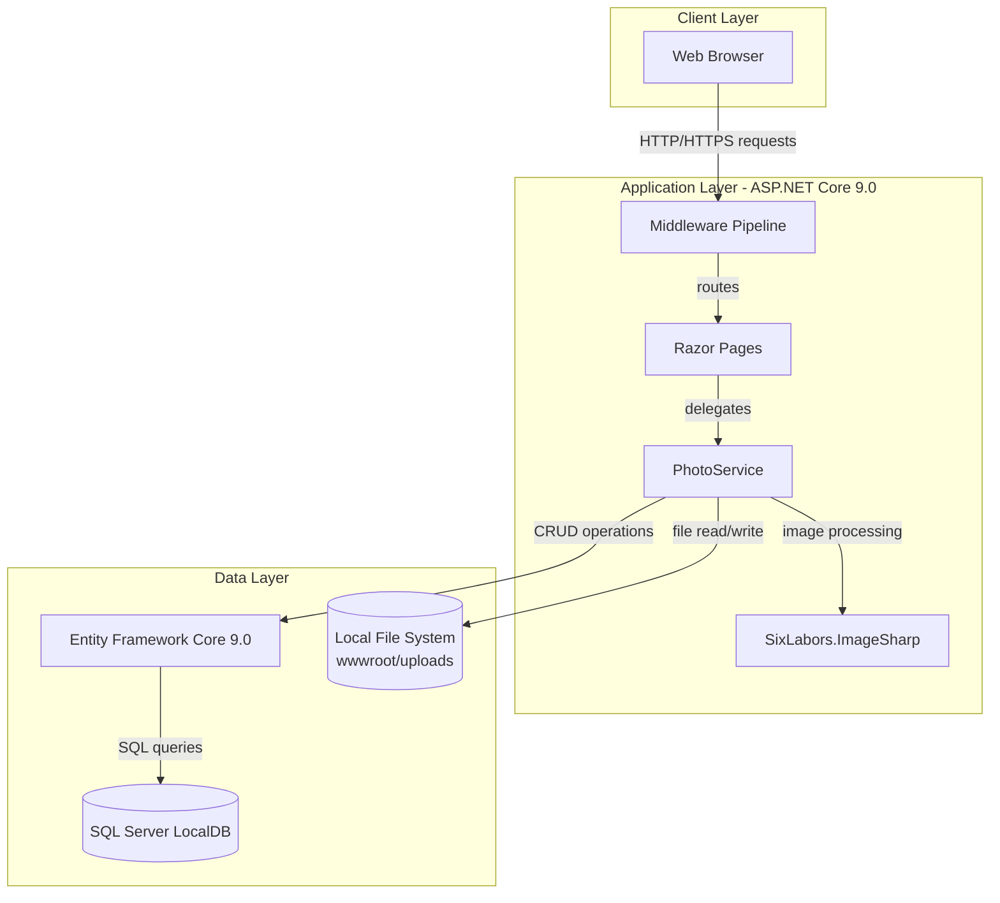
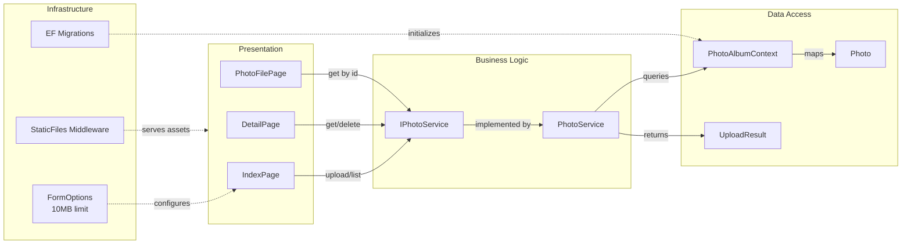

# Architecture Diagram

PhotoAlbum is an ASP.NET Core 9.0 Razor Pages application that provides photo gallery management with local file storage and SQL Server persistence.

## Application Architecture

## Component Relationships

