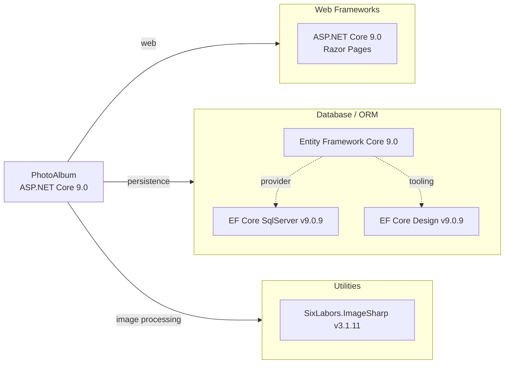

# Dependency Map

PhotoAlbum is an ASP.NET Core 9.0 Razor Pages application with 3 declared external dependencies (excluding test-only packages).

## Dependencies

```mermaid
flowchart LR
    App["PhotoAlbum\nASP.NET Core 9.0"]

    subgraph Web["Web Frameworks"]
        AspNet["ASP.NET Core 9.0\nRazor Pages"]
    end
    subgraph DB["Database / ORM"]
        EFCore["Entity Framework Core 9.0"]
        EFSqlServer["EF Core SqlServer v9.0.9"]
        EFDesign["EF Core Design v9.0.9"]
    end
    subgraph Util["Utilities"]
        ImageSharp["SixLabors.ImageSharp v3.1.11"]
    end

    App -->|"web"| Web
    App -->|"persistence"| DB
    App -->|"image processing"| Util
    EFCore -.->|"provider"| EFSqlServer
    EFCore -.->|"tooling"| EFDesign
```
